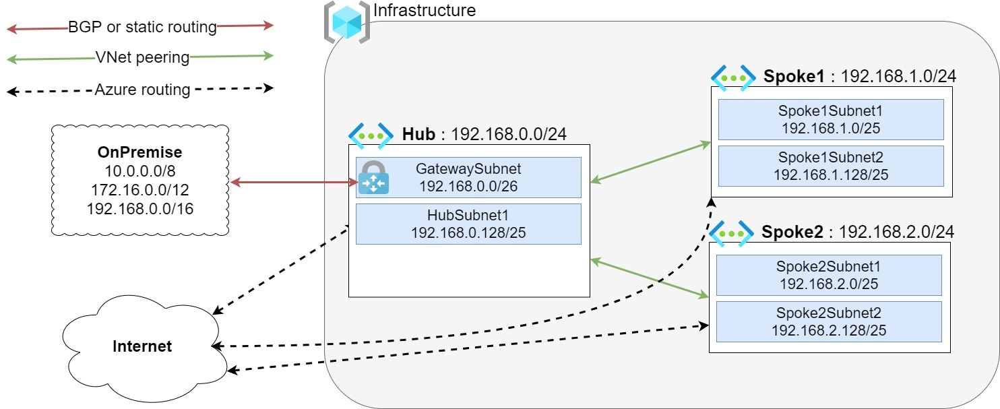
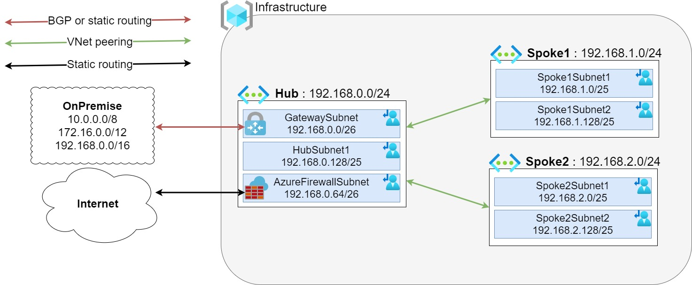
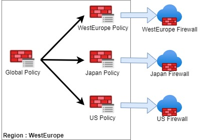

# Azure Firewall Hub & Spoke deployment

## Overview
This project provides some Terraform modules to deploy Azure Firewall in an hub and spoke infrastructure. 

Azure Firewall is a managed, cloud-based network security service that protects Azure Virtual Network resources. It's a fully stateful firewall as a service with built-in high availability and unrestricted cloud scalability.  
More information about Azure Firewall is available on [Azure documentation](https://docs.microsoft.com/en-us/azure/firewall/overview)

Hub and spoke infrastrcture don't need route table by default but Azure Firewall (or any other NVA) needs route tables to redirect the traffic through it.
This project will setup necessary route table to manage the North-South traffic using the firewall. Traffic between subnets inside a VNet still need to be managed by NSG (Azure good practice) and is currently not managed by this project.

**This project manage only infrastructure in a single subscription.**

# High Level Design

## Network design
In a hub and spoke architecture, the traffic is controlled by NSG on subnet or NIC level. Routing between hub and spoke VNet is automatically configured by peering but two spoke VNet cannot communicate directly without a routing component or an additional peering. 

<center>Hub and Spoke architecture without Azure Firewall</center>
<br/>

Azure Firewall will provide a central point for traffic flow filtering and routing. It can increase the network performance as two spoke VNet can now be routed without reaching the ExpressRoute. 

<center>Hub and Spoke architecture Azure Firewall</center>

## Routing management
Implementing Azure Firewall require to use Route tables to force the traffic through the firewall. Depending on the subnet a route table will be assign as following: 
* Gateway Route Table
    * Propagate gateway routes: Yes
    * Overwrite hub and spoke VNet routes through Azure Firewall
* Hub Route Table
    * Propagate gateway routes: No
    * Overwrite hub and spoke VNet routes through Azure Firewall
    * Inject OnPrem routes through Azure Firewall
* Spoke Route Table
    * Propagate gateway routes: No
    * Overwrite hub VNet routes through Azure Firewall
    * Overwrite Default through Azure Firewall

## Firewall Rules Organization

Parent and childs policy have to be on the same region. The Azure Firewall and the policy can be on different region. The parent policy rule is applied on top of the child policy whatever the priority. 




The grouping of the rules is the following:  
Policy > Rule Collection Groups > Rule Collection > Rule

Azure Firewall has 3 kind of rules : 
* **Network rule**: L4 firewall rule based on IP source / destination / protocol and port. 
* **Application rule**: L7 firewall rule based on FQDN for HTTP / HTTPS / MSSQL protocol
* **NAT rule**: Address translation rule to apply to the traffic. 

If you configure network rules and application rules, network rules are applied in priority order before application rules. If there's no network rule match, and if the protocol is HTTP, HTTPS, or MSSQL, the packet is then evaluated by the application rules in priority order.

# Implementation

## Requirements
You will need to install : 
* [Terraform](https://www.terraform.io/downloads.html) (tested with version v1.0.3)
* Terraform Provider (installed using command *terraform init*): 
  * azurerm

## Quickstart
To deploy Azure Firewall and the routing configuration you will have to customize : 
* provider.tf :
    * Replace the subscription_id by the subscprtion id where you want to create Azure Firewall
    * backend "azurerm" if you want to store your tfstate file in a Storage Account
* variables.tf : this is the main configuration file. It will describe your infrastructure. 
  * All variables firewall_policy_parent-* will be used to configure the firewall parent policy used by all the Azure Firewall
  *  firewall_policy_child variable map will create one or more policy used by Azure Firewall
  * azure_firewall variable map will create one or more Azure Firewall
  * route_tables varuabke map will create one or more routing configuration associated to Azure Firewall
* network-objects.tf : file contening network objects variables used by firewall rules
* global-firewall-rules.tf / weu-firewall-rules.tf : firewall rules collection to open in Azure Firewall. 

**Executions:** Applying this Terraform can generate a small network interruption when routing will be moved through Azure Firewall. Depending of the rule configured on the firewall, traffic can be dropped by the firewall if not configured correctly. 

````
> terraform init
> terraform plan
> terraform apply
````

### Demo / sandbox environnement
You can deploy a demo environnement using files in demo folder and Terraform. Provisioning this demo environnement will provide you this : 

You just have to customize provider.tf file with your own subscription_id and backend section if you want to store your tfstate file in a Storage Account. By default the ressources will be created in West Europe but it can be customize in varables.tf file.  
Provisioning the Virtual Network Gateway can take more than 20 minutes.
````
> terraform init
> terraform plan
> terraform apply
````
Once you have this environement, you will be able to run the Azure Firewall deployement on it. 

# Useful links
Azure Firewall documentation: 
- https://docs.microsoft.com/en-us/azure/firewall/overview
- https://registry.terraform.io/providers/hashicorp/azurerm/latest/docs/resources/firewall

Azure Firewall Terraform documentation : 
- https://registry.terraform.io/providers/hashicorp/azurerm/latest/docs/resources/firewall_policy_rule_collection_group

# Various
If you want to contribute to this project you are welcome.  
If you have any question, don't hesitate to contact me.